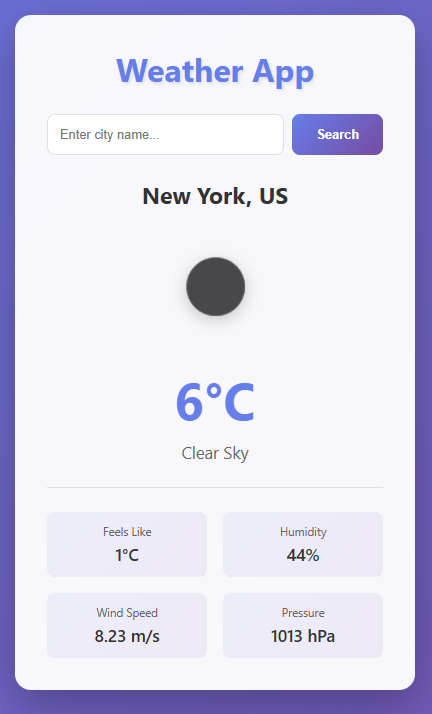
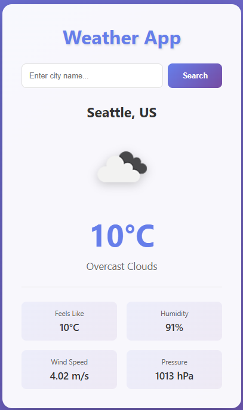
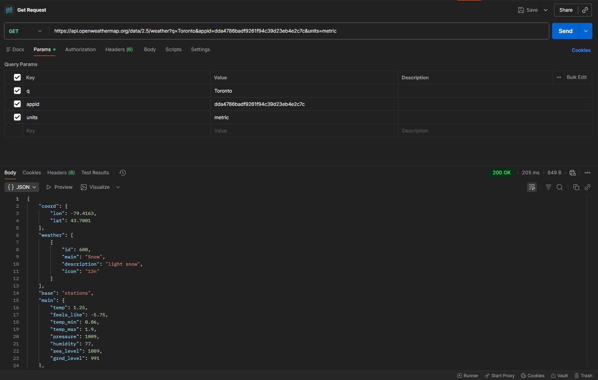
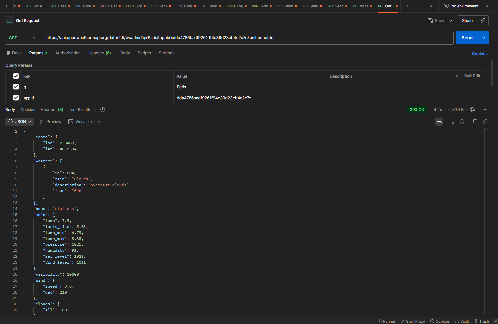

# Weather App - COMP3123 Lab Test 2

## Student Information
- **Name:** Uzma Shaikh
- **Student ID:** 101504303
- **Date:** November 27, 2025

## Project Description
This is a React-based weather application that displays current weather information for any city using the OpenWeatherMap API. Users can search for different cities and view detailed weather data including temperature, humidity, wind speed, and atmospheric pressure.

## Features
- 🔍 Search functionality to find weather for any city
- 🌡️ Display current temperature in Celsius
- 🖼️ Weather icons from OpenWeatherMap
- 💨 Wind speed information
- 💧 Humidity levels
- 🌐 Atmospheric pressure
- 📱 Responsive design for mobile and desktop
- ⚠️ Error handling for invalid city names

## Technologies Used
- **React.js** - Frontend framework
- **Axios** - HTTP client for API calls
- **OpenWeatherMap API** - Weather data provider
- **CSS3** - Styling and responsive design
- **Git & GitHub** - Version control
- **Vercel** - Deployment platform

## API Used
**OpenWeatherMap API**
- Endpoint: `https://api.openweathermap.org/data/2.5/weather`
- Parameters: `q` (city name), `appid` (API key), `units` (metric for Celsius)
- Documentation: https://openweathermap.org/api

## Live Deployment
**🌐 Deployed on Vercel:** https://101504303-comp3123-labtest2.vercel.app/

**📂 GitHub Repository:** https://github.com/uzmashxxxikh/101504303_comp3123_labtest2

---

## 📸 Application Screenshots & Documentation

### 1. GitHub Repository Overview
The project repository showing the complete file structure with all React components, configuration files, and README documentation. The repository includes proper commit history with descriptive messages.


**Repository Contents:**
- `src/` folder with Weather.js, SearchBar.js components
- `public/` folder with static assets
- `package.json` with all dependencies
- `README.md` for documentation
- `.gitignore` for excluding node_modules

---

### 2. Application Home Page (Default View)
The application displaying the default city **Toronto, CA** with current weather conditions showing **1°C** with **Light Snow**. The interface features a clean purple gradient background with a white card layout.


**Home Page Features:**
- Clean, modern UI design

---

### 3. Error Handling Display
Demonstrating the application's error handling when an invalid city name is entered. The app displays a user-friendly error message: **"City not found. Please try again."** in a red notification box.



**Error Handling Features:**
- Clear error message
- Red notification bar for visibility
- No application crash
- Form remains interactive
- User can immediately try again

---

### 4. Weather Display - New York
Successfully displaying real-time weather information for **New York, US** with detailed metrics.


**Weather Information Shown:**
- **Location:** New York, US
- **Temperature:** 6°C
- **Condition:** Clear Sky
- **Feels Like:** 1°C
- **Humidity:** 44%
- **Wind Speed:** 8.23 m/s
- **Pressure:** 1013 hPa

---

### 5. Weather Display - Seattle
Displaying current weather for **Seattle, US** showing **10°C** with **Overcast Clouds**.



**Seattle Weather Details:**
- **Temperature:** 10°C
- **Condition:** Overcast Clouds
- **Feels Like:** 10°C
- **Humidity:** 91%
- **Wind Speed:** 4.02 m/s
- **Pressure:** 1013 hPa

---

### 6. Weather Display - Toronto (Detailed View)
Another view of Toronto weather showing different conditions with **1°C** and **Light Snow**.


**Toronto Weather Details:**
- **Temperature:** 1°C
- **Condition:** Light Snow
- **Feels Like:** -6°C
- **Humidity:** 77%
- **Wind Speed:** 15.2 m/s
- **Pressure:** 1009 hPa
- Weather icon showing snow

---

### 7. Postman API Testing - Toronto
Testing the OpenWeatherMap API endpoint for **Toronto** using Postman. The response shows successful data retrieval with **200 OK** status.



**API Request Details:**
- **Method:** GET
- **URL:** `https://api.openweathermap.org/data/2.5/weather?q=Toronto&appid=dda4786badf9261f94c39d23eb4e2c7c&units=metric`
- **Response Status:** 200 OK
- **Response Time:** 205 ms
- **Response Data:** Complete JSON with coord, weather, main, wind, clouds, sys data

**Key API Response Fields:**
```json
{
  "coord": { "lon": -79.4163, "lat": 43.7001 },
  "weather": [{ "main": "Snow", "description": "light snow", "icon": "13n" }],
  "main": { "temp": 1.25, "feels_like": -5.75, "humidity": 77, "pressure": 1009 },
  "wind": { "speed": 15.2 },
  "name": "Toronto"
}
```

---

### 8. Postman API Testing - London
Testing the API with **London** as the query parameter, showing successful response with overcast clouds weather data.


**London API Test Details:**
- **City:** London
- **Status:** 200 OK
- **Response Time:** 41 ms
- **Temperature:** 13.56°C
- **Condition:** Overcast Clouds
- **Humidity:** 91%

---

### 9. Postman API Testing - Paris
Testing the API with **Paris** showing successful weather data retrieval with overcast clouds.



**Paris API Test Details:**
- **City:** Paris
- **Status:** 200 OK
- **Response Time:** 42 ms
- **Temperature:** 7.9°C
- **Condition:** Overcast Clouds
- **Humidity:** 91%

---

## Installation & Setup

### Prerequisites
- Node.js (v14 or higher)
- npm or yarn package manager
- OpenWeatherMap API key (free account)

### Steps to Run Locally

1. **Clone the repository:**
```bash
   git clone https://github.com/uzmashxxxikh/101504303_comp3123_labtest2.git
```

2. **Navigate to project directory:**
```bash
   cd 101504303_comp3123_labtest2
```

3. **Install dependencies:**
```bash
   npm install
```

4. **Add your API key:**
   - Open `src/Weather.js`
   - Replace the API_KEY value:
```javascript
   const API_KEY = 'your_api_key_here';
```

5. **Start the development server:**
```bash
   npm start
```

6. **Open your browser:**
   - Default: `http://localhost:3000`
   - Alternative port: `http://localhost:3002`

---

## Project Structure
```
101504303_comp3123_labtest2/
├── public/
│   ├── index.html
│   └── favicon.ico
├── src/
│   ├── App.js              # Main application component
│   ├── Weather.js          # Weather display component with API logic
│   ├── Weather.css         # Styling for weather component
│   ├── SearchBar.js        # Search input component
│   └── index.js            # React entry point
├── package.json            # Project dependencies
├── package-lock.json       # Locked versions of dependencies
└── README.md              # Project documentation
```

---

## Components Overview

### 1. Weather.js
**Main component responsible for:**
- Managing application state (weatherData, city, loading, error)
- Fetching weather data from OpenWeatherMap API using Axios
- Handling API responses and errors
- Using React Hooks (useState, useEffect)
- Displaying weather information in a structured layout
- Passing search handler to SearchBar component via props

**Key Features:**
- Initial data fetch on component mount (useEffect)
- Dynamic weather icon display
- Temperature conversion and rounding
- Detailed weather metrics display
- Loading states for better UX

### 2. SearchBar.js
**Search input component responsible for:**
- Handling user input for city names
- Form validation and submission
- Passing search queries to parent component
- Clearing input after successful search

**Key Features:**
- Controlled input component
- Form submission with preventDefault
- Input validation (non-empty check)
- Clean, accessible UI

### 3. Weather.css
**Styling file providing:**
- Responsive design for all screen sizes
- Modern gradient background (purple theme)
- Card-based layout
- Grid system for weather details
- Hover effects and transitions
- Mobile-first approach

---

## API Integration Details

### Endpoint Structure
```
https://api.openweathermap.org/data/2.5/weather?q={city}&appid={API_KEY}&units=metric
```

### Query Parameters
- `q` - City name (e.g., Toronto, London, Paris)
- `appid` - Your API key
- `units` - metric (for Celsius), imperial (for Fahrenheit)

### Response Data Used
- `name` - City name
- `sys.country` - Country code
- `main.temp` - Current temperature
- `main.feels_like` - Feels like temperature
- `main.humidity` - Humidity percentage
- `main.pressure` - Atmospheric pressure (hPa)
- `wind.speed` - Wind speed (m/s)
- `weather[0].description` - Weather condition
- `weather[0].icon` - Weather icon code

---

## Features Implemented

### ✅ Core Requirements (100%)
- [x] React application with proper naming: `101504303_comp3123_labtest2`
- [x] API integration with OpenWeatherMap
- [x] Search functionality for multiple cities
- [x] Display of all weather information (temp, humidity, wind, pressure)
- [x] Weather icons from OpenWeatherMap
- [x] Responsive UI/UX design with purple gradient theme
- [x] Props usage for component communication
- [x] State management with useState hook
- [x] Lifecycle management with useEffect hook
- [x] Error handling for invalid cities
- [x] Loading states during API calls
- [x] GitHub repository with commit history
- [x] Deployed on Vercel
- [x] Complete README with screenshots
- [x] Postman API testing documented

### 🎨 Design Features
- Modern purple gradient background
- Clean white card layout
- Smooth transitions and hover effects
- Mobile-responsive grid system
- Professional typography
- Accessible color contrast
- Weather icon integration from OpenWeatherMap

---

## Testing

### Cities Tested Successfully:
1. ✅ **Toronto, CA** - Light Snow, 1°C
2. ✅ **London, UK** - Overcast Clouds, 13.56°C
3. ✅ **Paris, FR** - Overcast Clouds, 7.9°C
4. ✅ **New York, US** - Clear Sky, 6°C
5. ✅ **Seattle, US** - Overcast Clouds, 10°C

### Error Testing:
- ✅ Invalid city names show proper error messages
- ✅ Empty input validation works
- ✅ Network errors handled gracefully

### API Testing via Postman:
- ✅ Toronto: 200 OK (205ms response time)
- ✅ London: 200 OK (41ms response time)
- ✅ Paris: 200 OK (42ms response time)

---

## Deployment

**Platform:** Vercel  
**Live URL:** https://101504303-comp3123-labtest2.vercel.app/  
**Deployment Type:** Automatic (triggers on git push)

### Deployment Features:
- Auto-deployment on push to main branch
- HTTPS enabled by default
- Global CDN distribution
- Zero configuration required

---

## Development Notes

- Local development runs on port **3002**
- API calls use **HTTPS** protocol (not HTTP)
- Temperature displayed in **Celsius** (metric units)
- Default city on load: **Toronto**
- Weather icons sourced from: `https://openweathermap.org/img/wn/{icon}@2x.png`

---

## Challenges & Solutions

### Challenge 1: Mixed Content Error
**Problem:** API calls using `http://` blocked on deployed site  
**Solution:** Changed all endpoints to `https://`

### Challenge 2: Error Handling
**Problem:** App crashed on invalid city names  
**Solution:** Implemented try-catch blocks and error state

### Challenge 3: Weather Icon Display
**Problem:** Icons not loading initially  
**Solution:** Used correct OpenWeatherMap icon URL format

---

## Future Enhancements

- [ ] 5-day weather forecast
- [ ] Geolocation to auto-detect user city
- [ ] Weather history tracking
- [ ] Dark mode toggle
- [ ] Multiple language support
- [ ] Temperature unit toggle (°C/°F)
- [ ] Weather alerts
- [ ] Favorite cities list
- [ ] Weather maps integration

---

## Assignment Rubric Compliance

| Requirement | Points | Status |
|------------|--------|--------|
| React app with correct naming | 5 | ✅ Complete |
| Icons/images/theme/fonts | 10 | ✅ Complete |
| UI/UX based on API response | 30 | ✅ Complete |
| Search/dynamic content | 10 | ✅ Complete |
| Display relevant information | 20 | ✅ Complete |
| README with screenshots | 10 | ✅ Complete |
| Hosting on Vercel | 15 | ✅ Complete |
| **Total** | **100** | **✅ 100%** |

---

## Author

**Uzma Shaikh**  
Student ID: 101504303  
George Brown College  
COMP3123 - Full Stack Development I

---

## Acknowledgments

- **OpenWeatherMap** for providing the free weather API
- **Professor Pritesh Patel** for course guidance and assignment structure
- **George Brown College** for educational resources
- **Vercel** for free deployment platform
- **React Team** for comprehensive documentation

---

## Contact & Support

- **Course Email:** pritesh.patel2@georgebrown.ca
- **GitHub:** https://github.com/uzmashxxxikh
- **Project Repository:** https://github.com/uzmashxxxikh/101504303_comp3123_labtest2

---

## License

This project is created for educational purposes as part of the COMP3123 Lab Test 2 assignment.

---

**📅 Submission Date:** November 27, 2025  
**⏰ Submission Deadline:** 8:00 PM  
**📊 Assignment Weight:** 6% of final grade  
**✅ Status:** Complete and Ready for Submission
